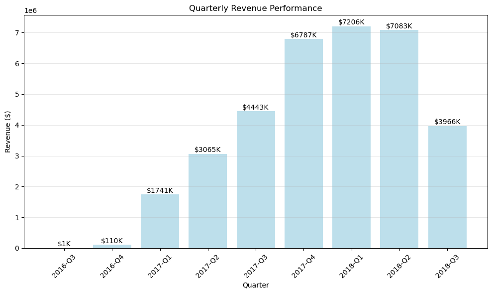
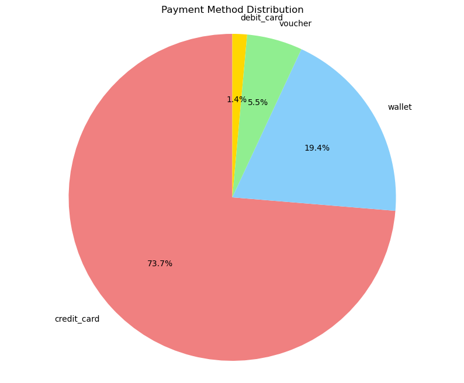
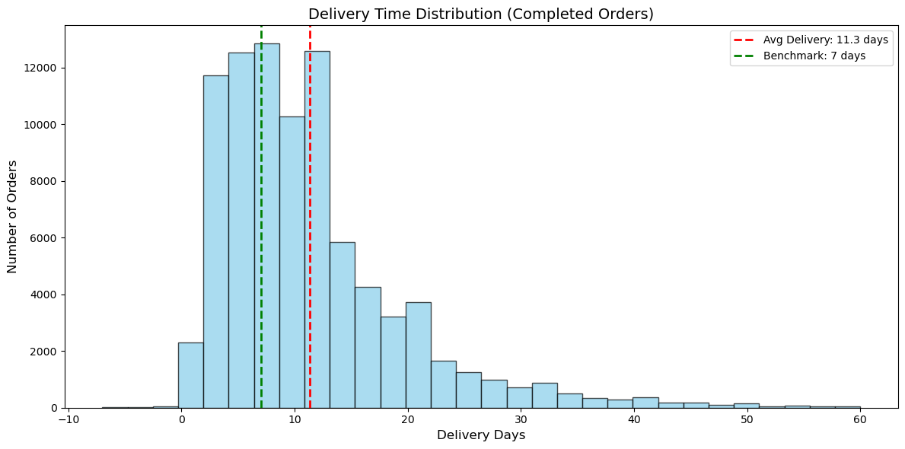

# Muhammad Izhar Syauqi

**Data Analyst | Python · Excel · SQL · Operational Analytics**

I’m a data analyst based in Kedah, Malaysia, with experience in renewable energy performance analysis and B2B operations. At NovaSource Power Services, I monitor data quality across 65 PV plant sites and built a Python script to automate recurring outlier cleanup. Previously, I supported logistics reporting, order fulfilment, and Excel-based market analysis.

[**View my portfolio**](https://izharsyauqi-portfolio.netlify.app/) · [View my CV (PDF)](https://izharsyauqi-portfolio.netlify.app/files/Muhammad_Izhar_Syauqi_CV.pdf) · [Open this project notebook](notebooks/Ecommerce_Data_Analysis.ipynb) · [Email me](mailto:izharsyauqi9@gmail.com) · [LinkedIn](https://www.linkedin.com/in/izharsyauqi)

## Featured project: E-commerce analytics

An exploratory analysis of customer behavior and business performance using a multi-table e-commerce dataset. The notebook covers data quality checks, cleaning, table joins, exploratory analysis, and visualizations for revenue, payment methods, delivery performance, and geography.

**Tools:** Python, Pandas, Matplotlib, Seaborn, Jupyter Notebook

### Notebook workflow

1. Audit missing values and duplicates across the orders, customers, order items, products, and payments tables.
2. Investigate duplicate product IDs and standardize text and date fields.
3. Derive delivery and time-based fields, then join the tables for analysis.
4. Explore order value, payment preferences, delivery times, product categories, and geographic patterns.
5. Summarize the results with charts and business-facing metrics.

### Selected notebook results

The notebook reports results for **89,316 orders** dated September 2016 to September 2018:

- **$34.40M** total revenue and **$385.18** average order value, using the notebook’s price-plus-shipping calculation.
- **97.9%** of orders were classified as completed; the reported average delivery time was **11.3 days**.
- Credit card was the most common payment method, used on **65,814 orders (73.7%)**.
- São Paulo (SP) had the most customers (**37,879**) and the highest reported revenue (**$14.59M**).

These are exploratory notebook outputs, not audited business metrics. Join cardinality and aggregation choices can affect order counts and revenue, so the data model and metric definitions should be validated before using the results for business reporting. The analysis describes patterns and does not establish causes.

### Visuals from the notebook

<p align="center">
  
  
</p>

<p align="center">
  
</p>

## Run the notebook

The dataset is available from [Kaggle](https://www.kaggle.com/datasets/bytadit/ecommerce-order-dataset). The notebook currently expects these CSV files in its working directory: `df_Orders.csv`, `df_Customers.csv`, `df_OrderItems.csv`, `df_Products.csv`, and `df_Payments.csv`.

```bash
git clone https://github.com/IzharSyauqi/ecommerce-analytics.git
cd ecommerce-analytics
python -m venv .venv
```

Activate the environment (`.venv\Scripts\Activate.ps1` in Windows PowerShell, or `source .venv/bin/activate` on macOS/Linux), then install the project requirements:

```bash
python -m pip install --upgrade pip
python -m pip install -r requirements.txt
jupyter notebook notebooks/Ecommerce_Data_Analysis.ipynb
```

Download the five dataset CSVs from Kaggle and place them where the notebook can access them. If you store them in `data/raw/`, update the notebook’s input paths to point to that folder. The raw dataset is not included in this repository.

## Repository contents

```text
├── README.md
├── requirements.txt
├── notebooks/
│   └── Ecommerce_Data_Analysis.ipynb
├── docs/
│   └── ecommerce-business-intelligence-analysis.pdf
├── images/                  # Notebook visualizations
├── data/                    # Empty placeholder; raw data is not committed
└── src/                     # Placeholder for reusable scripts
```

## Contact

[Portfolio](https://izharsyauqi-portfolio.netlify.app/) · [Email](mailto:izharsyauqi9@gmail.com) · [LinkedIn](https://www.linkedin.com/in/izharsyauqi)
